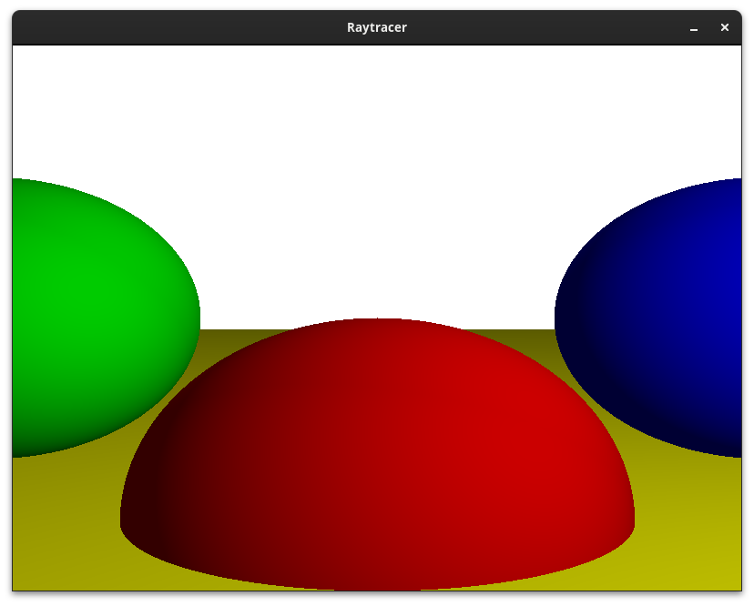

# raytracer
A Raytracer written in Rust

This raytracer is based on the [Computer Graphics from Scratch](https://www.gabrielgambetta.com/computer-graphics-from-scratch/)

This is how it looks like:

